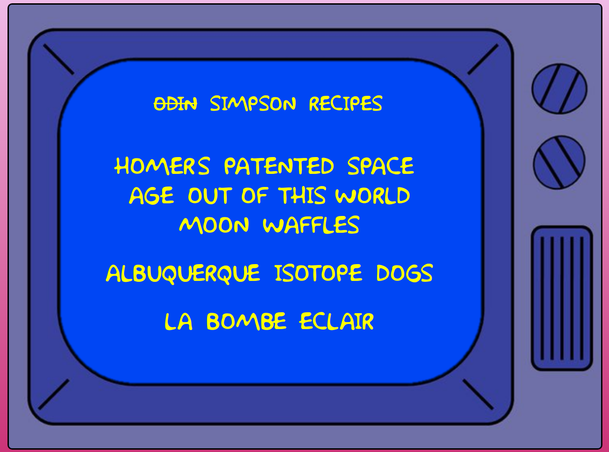

# Odin Recipes

A repository highlighting the first project from [The Odin Project](https://www.theodinproject.com/). This project is a basic website that hosts several recipes, including an image of the finished recipe, a short description, the ingredients required, and the steps necessary to make the recipe. My inspiration for this website is the infamous Simpsons TV series. I'm currently in the process of updating the recipe pages, so right now only the home-page matches my new style. 

**Website link: [https://gkoval11.github.io/odin-recipes/](https://gkoval11.github.io/odin-recipes/)**

## Recipes included: 

* Homer's Patented Space-Age Out-of-this-World Moon Waffles
* Albuquerque Isotope Dogs
* La Bombe Eclair

Right now the project is just using barebones html to achieve everything. In the future, I plan to come back to add css and javascript to make it a more complete website. 

## Homepage: 

The website is designed to look like the opening credits from the classic Simpsons episodes: 

